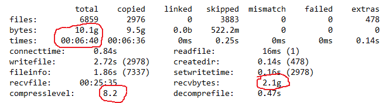
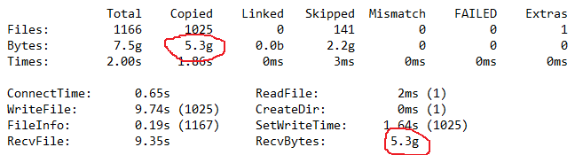
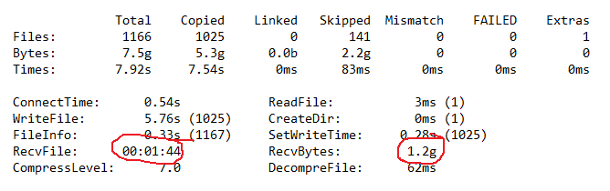
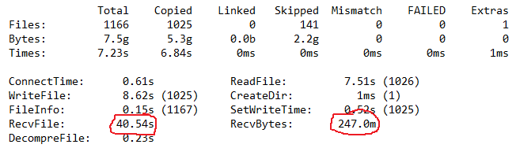
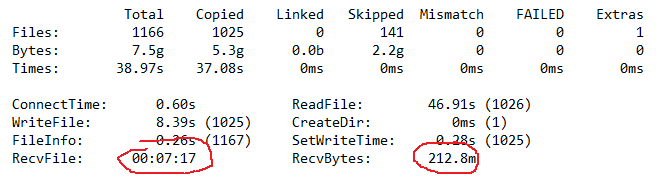

**Case study**

When people working from home it is more important than ever to speed up transferring of files from office to home and back.
In EACopy we recently added delta compression and here are the results.

**Compression**

EACopy<->EACopyService can do on-demand compression which is self-regulating based on network performance.
So, if bandwidth is high, compression is low and if bandwidth is low, compression is high.
Just start an EACopyService on or close to the network share and let EACopy communicate through it to enable compression (need /C on commandline).
Here's a real case example of a copy where compression is enabled. It copied 10.1gb but only 2.1gb travelled over the wire. Average compression level (zstd) ended up being 8.2

 
**Delta compression.**

I experimented with this 2 years ago, but at the time I couldn’t find any delta compression platform that was both efficient and fast (which is needed for on-demand delta compression).
I gave it another chance this weekend (2021 june 12) and tested primarily xdelta and zstd.
Facebook added delta compression to zstd ~1 year ago and the results are very impressive.
Basically how it works is that when EACopy is about to copy a file from the share it checks if it already has a version of that file (same filename in same location).
If it has, it sends the “last written time” and size of that file to the EACopyService.
Since the EACopyService keeps track of all the files it has seen it will likely be aware of that old file and where to find it on the share.

If the service doesnt recognize the file it will use normal self regulating compression.

If the service does recognize the old file and it is still on the share it can create a delta patch between the old file that the client has and the new file the client wants.
The client then applies the received patch onto the old file to turn it to the new file.

**The results**

Below are some interesting numbers. This was done using two builds mostly containing dlls and pdbs.
There were 1025 diffing files in there, mostly dlls and pdbs.
In my experiment I ran both the EACopyService and the EACopy on my local computer and I forced the compression to a certain level instead of letting it dynamically control it (since then compression would end up being 0 because bandwidth is obviously very high)

**Normal copy**

As you can see 5.3gb was copied out of 7.5gb.. the rest was skipped because the old and new build matched. Without compression all 5.3gb needs to be sent over the wire.

 
**Compression (zstd with fixed level 7)**

With zstd compression fixed to level 7 the eacopyservice compressed 5.3gb down to 1.2gb.
The client spent 1min and 44 seconds waiting for data to come from the network socket.
Since I’m running locally on my machine I know 100% of that time is the actual compression time on the server side.
Note RecvFile time is thread time and not wall time and current copy uses 16 threads, so actually only 6 seconds wall time was used doing compression of 5.3gb down to 1.2gb which is awesome.
That time will be hidden from the actual transfer time of those 1.2gb when sending to remote clients.
 

**Delta compression (zstd)**

These numbers are very impressive. Not only did it manage to compress the delta down to 247mb(!) but it also did it in 40 seconds (2.5 seconds wall time).
This is crazy good. I don’t know if this scenario is just exceptionally good or if this is expected.
The downside with this approach is that the EACopyService must read two files to produce the delta. It needs to read the old and the new file from the share, so if bandwidth between EACopyService and network share is poor this will affect the results.

**Delta compression (xdelta+lzma)**

Compression is good but the time it takes to produce the delta is too long to be useful for on-demand delta compression.
It does beat zstd size-wise landing at 213mb but it took its time. It took ~27seconds wall time to create the compressed delta of those 5.3gb.
In other experiments I’ve also noticed that xdelta doesnt work as well with really large files (>1gb), cost go up dramatically, while zstd delta compression scales really well.
So the little size benefit is not worth it in our typical scenarios.

